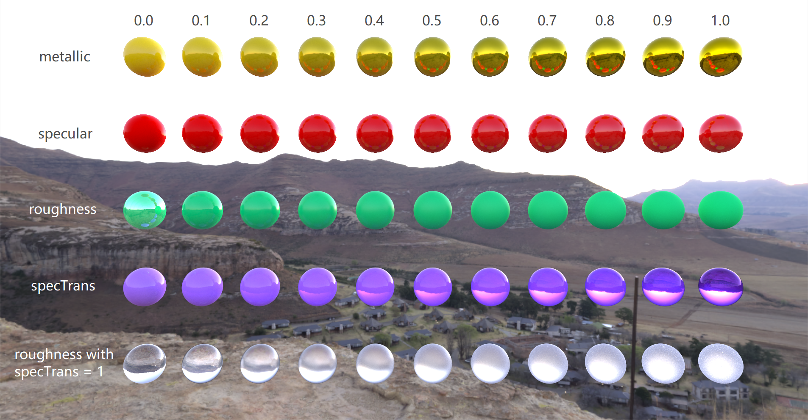
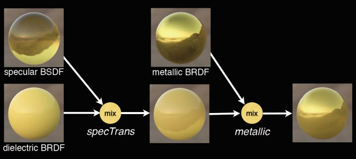
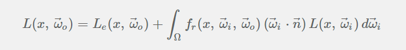
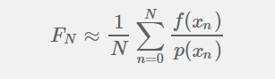
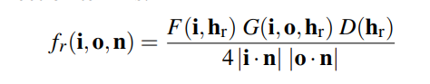
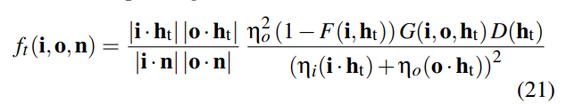

# Physically based rendering Path Tracer in Unity3D using compute shader

Unity 2018.3.7f1 (win10 64-bit)

## Material parameters:
1. albedo 
2. specular (control the specular high light)
3. metallic 
4. roughness 
5. specTrans  (control transparency of the material. This parameter is to blend metallic BRDF with dielectricc BSDF and it is taken from Disney's BSDF)   
    
form [Extending the Disney BRDF to a BSDF with Integrated Subsurface Scattering](https://blog.selfshadow.com/publications/s2015-shading-course/burley/s2015_pbs_disney_bsdf_slides.pdf)

## Features:
1. Path-Traced Physically based rendering based on Monte Carlo integration
2. PBR BRDF and PBR BTDF
3. Physically based parameters
4. Hemisphere Sampling, importance sampling GGX

## Principle:   

### Rendering Equation    
 
### Monte Carlo Integration   
 
### Pbr BRDF
This demo used cook-torrance BRDF. The choice of D,G,F term refers to the PBR implementation in UE4.
    
[Formula Derivation](Screenshot/Derivation/BRDF) 

### Pbr BSDF = BRDF + BTDF
The BSDF/BTDF used in this demo is from Walter's paper [Microfacet Models for Refraction through Rough Surfaces](http://www.cs.cornell.edu/~srm/publications/EGSR07-btdf.pdf)
    
**Notice!** This BTDF is not reciprocal, be careful about the direction!    
[Formula Derivation](Screenshot/Derivation/BTDF) 

  

## Reference:
[GPU Path Tracing in Unity – Part 2](http://three-eyed-games.com/2018/05/12/gpu-path-tracing-in-unity-part-2/)    
[Rendering Equation](http://www.cse.chalmers.se/edu/year/2011/course/TDA361/2007/rend_eq.pdf)   
[Monte Carlo Methods in Practice](https://www.scratchapixel.com/lessons/mathematics-physics-for-computer-graphics/monte-carlo-methods-in-practice/monte-carlo-methods)   
[蒙特·卡罗(Monte Carlo)积分详解](https://www.qiujiawei.com/monte-carlo/)    
[Reflection, Refraction (Transmission) and Fresnel](https://www.scratchapixel.com/lessons/3d-basic-rendering/introduction-to-shading/reflection-refraction-fresnel)    
[Webgl中采用PBR的实时光线追踪](https://zhuanlan.zhihu.com/p/58692781)   
[Learnopengl](https://learnopengl.com/PBR/Theory)   
[Real Shading in Unreal Engine 4](https://de45xmedrsdbp.cloudfront.net/Resources/files/2013SiggraphPresentationsNotes-26915738.pdf)   
[基于物理着色（一）](https://zhuanlan.zhihu.com/p/20091064)     
[Microfacet Models for Refraction through Rough Surfaces](http://www.cs.cornell.edu/~srm/publications/EGSR07-btdf.pdf)    
[Microfacet models for refection and refraction](http://www.cs.cornell.edu/courses/cs5625/2016sp/slides/04ufacet.pdf)    
[Extending the Disney BRDF to a BSDF with Integrated Subsurface Scattering](https://blog.selfshadow.com/publications/s2015-shading-course/burley/s2015_pbs_disney_bsdf_notes.pdf) [Extending the Disney BRDF to a BSDF with Integrated Subsurface Scattering](https://blog.selfshadow.com/publications/s2015-shading-course/burley/s2015_pbs_disney_bsdf_slides.pdf)    
[Disney Principled BRDF实现笔记](https://zhuanlan.zhihu.com/p/57771965)    
[Cook-Torrance BRDF](https://www.youtube.com/watch?list=PLslgisHe5tBPckSYyKoU3jEA4bqiFmNBJ&v=k9Nz2z1jTFQ&feature=emb_logo)     
[Microfacet Models](http://www.pbr-book.org/3ed-2018/Reflection_Models/Microfacet_Models.html)     
[Surface Reflection: Physical and Geometrical Perspectives ](https://www.ri.cmu.edu/pub_files/pub3/nayar_s_k_1989_1/nayar_s_k_1989_1.pdf)    
[Advanced Global Illumination]     
[How Is The NDF Really Defined?](http://www.reedbeta.com/blog/hows-the-ndf-really-defined/)    
[ENERGY CONSERVATION IN GAMES](http://www.rorydriscoll.com/2009/01/25/energy-conservation-in-games/)    
[Adopting a physically based shading model](https://seblagarde.wordpress.com/2011/08/17/hello-world/)

